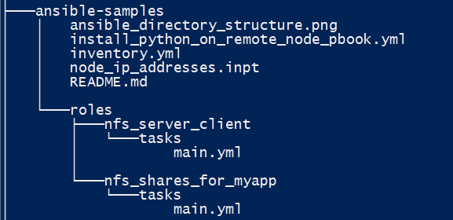

# Ansible
Ansible is a powerful tool that is especially useful in remote configuration management of all compute resources that form your infrastructure.

Using machine groups within an inventory file, one can apply specific configurations to the target group of machines that need this configuration.

Together with the 'machine groups', Ansible uses an hierarchical arrangement of 'playbooks' 'roles' and 'tasks' to apply complex configurations of OS settings, services enablement and configration, middleware installation, and application installation on a target cluster of systems. Rightly done, Ansible automates the rollout of an entire application-cluster simply, repeatedly, error-free.

Before ansible can run against a target, we need to ensure that Python is installed on the target. This is done by setting gather_facts to False and running some pre_tasks using the 'raw' module. See the code in 'install_python_on_remote_node_pbook' for sample code. (The code deals only with Ubuntu and RedHat; windows and other *nixes are not covered.)

## Roles and Tasks
Consider the hosts in your inventory as 'raw actors'. In Ansible terms, when you want to purpose a 'raw actor' to be a web-server, or a DB server, you would apply the web_server 'role' or the DB server 'role' to the host.

In Ansible, a role is a collection of tasks that are to be run against a host in order to purpose the host for that role. A role is organised as a directory with a sub-directory (tasks) that holds the tasks.

Ansible Directory Structure:

